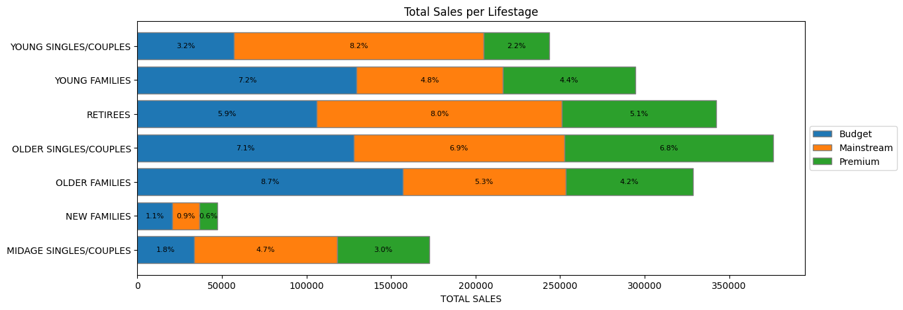

# Quantium零售数据分析

[English](README.md) | **简体中文**

本项目通过分析薯片销售数据和客户购买行为，识别最有价值的客户群体；再以可比门店为基准评估门店布局试点对销售额和客户数的影响，最后将分析发现整理为品类管理决策报告。

---

### 使用的代码与资源

**运行环境：** Python 3.13.9；pandas、numpy、matplotlib、scipy、openpyxl、mlxtend 0.25.0。

---

### Task 1 - 数据准备与客户分析

分析交易和客户属性，识别薯片购买行为，并提出可通过后续实验验证的商业建议。

#### 数据清洗

- 读取 `QVI_purchase_behaviour.csv`（72,637 条客户记录）和 `QVI_transaction_data.xlsx`（264,836 条交易明细）。按 `LYLTY_CARD_NBR` 合并前，检查客户键唯一且非空、每条交易都能匹配客户，并确认合并没有改变交易行数和销售额总和。
- 以 1899-12-30 为起点转换 Excel 日期序列值。观察期为 2018-07-01 至 2019-06-30；数据中 2018-12-25 没有交易记录。
- 本任务聚焦薯片，因此剔除 18,094 条 Salsa 商品明细。核查同一客户购买 200 包的两条异常记录并将其剔除，同时保留购买 5 包等正常记录；最终剩余 246,740 条商品明细。
- 在 `Cleaned_Brand_Names` 中统一品牌名称，并从商品名称提取包装规格。
- 用 `STORE_NBR + LYLTY_CARD_NBR + DATE + TXN_ID` 识别一次购买。直接把商品明细行数当作购买次数，会略微高估交易频率。

#### 客户分群分析

- 按 `LIFESTAGE` 和 `PREMIUM_CUSTOMER` 分群，计算销售额、去重客户数、去重购买次数、购买包数、每客户购买次数、每次购买包数及销售额、每客户销售额、按销量加权的每包价格，以及购买至少两次的客户占比。
- 将销售额分解为 **客户数 × 每客户购买次数 × 每次购买销售额**，区分客户规模、购买频率和单次消费的影响。
- 比较各群体的品牌和包装规格偏好，并对年轻及中年单身／情侣群体的消费金额进行探索性的逐行 Welch 检验。同一客户可能重复购买，因此该 p 值不能解释为客户层面的因果结论。

| 销售额排名 | 客户群体 | 总销售额 | 客户数 | 每客户购买次数 | 每次购买包数 | 复购客户占比 |
| ---: | --- | ---: | ---: | ---: | ---: | ---: |
| 1 | 年长家庭 / Budget | $156,863.75 | 4,611 | 4.624 | 1.963 | 79.0% |
| 2 | 年轻单身／情侣 / Mainstream | $147,582.20 | 7,917 | 2.461 | 1.859 | 63.1% |
| 3 | 退休人群 / Mainstream | $145,168.95 | 6,358 | 3.126 | 1.895 | 72.3% |

其他图表：[各人生阶段客户数](graphs/module1_customers_by_lifestage.png)；[各群体每客户购买包数](graphs/module1_units_per_customer.png)。

#### 分析发现

- 年长家庭 / Budget 的销售额最高。其每客户平均有 4.624 次去重购买；较高的购买频率解释了其在客户规模小于另外两个头部群体时仍能位居第一。
- 在前三大群体中，年轻单身／情侣 / Mainstream 的客户数最多；退休人群 / Mainstream 也有较大的客户基数。按每客户购买包数看，年长家庭和年轻家庭处于领先位置。
- Kettle 是各群体最常购买的品牌。Doritos 在**年轻单身／情侣 / Mainstream**中排名第二。最常见的包装规格为 175g，其次是 150g。
- 以上是观察到的购买模式。针对购买频率、单次购买量或品牌偏好的促销措施，仍需分别验证其增量销售额和利润效果。

---

### Task 2 - 试点实验与增量效果分析

以可比门店为基准，评估 77、86、88 号店在 2019-02 至 2019-04 布局试点期间的表现。

#### 门店月度指标与候选对照店

- 直接使用提供的 `QVI_data.csv`：共 264,834 行，已排除两条购买 200 包的异常记录，但仍包含 Salsa。因此，Task 2 的门店销售额涵盖范围比 Task 1 的“仅薯片”口径更广，不能直接相互比较。
- 按门店和月份汇总销售额、去重客户数、每客户去重交易次数、每次交易购买包数、平均每包销售额。交易次数采用 Task 1 所述的复合购买键。
- 候选对照店必须拥有完整的 12 个月观察记录；仅用试点前的 2018-07 至 2019-01 共 7 个月选择对照店，并从候选名单中排除全部 3 家试点店。

#### 对照门店筛选

- 对齐月份后，比较试点店与候选店在**完整 7 个月时间序列**上的销售额和客户数，再计算跨月趋势相关性。
- 对每项指标，将 7 个月 Pearson 相关系数映射到 [0, 1]，再与按月对齐的规模相似度 `exp(-mean(abs(trial - control)) / mean(trial))` 等权合并；最后将销售额和客户数的得分等权平均。综合得分越高，按该规则越适合用作对照。

| 试点店 | 选定对照店 | 试点前销售额相关系数 | 试点前客户数相关系数 |
| ---: | ---: | ---: | ---: |
| 77 | 233 | 0.904 | 0.990 |
| 86 | 155 | 0.878 | 0.943 |
| 88 | 237 | 0.308 | 0.947 |

237 号店是与 88 号店综合相似度得分最高的候选店，但销售额相关系数仅为 0.308。另一候选店 40 号的销售额和客户数相关系数分别为 -0.148、-0.129。因此，需要对 88 号店进行对照店选择敏感性分析。

#### 销售额与客户数的试点结果

- 分别按试点前 7 个月的“试点店总量／对照店总量”比例缩放所选对照店的指标，再按**门店配对与月份**合并实际值和对照值，而不是按行位置拼接。
- 逐月计算 `试点店 / 缩放后的对照店 - 1`。效果估计量为试点期间与试点前的**平均月度差距变化**；下表还列出试点期 3 个月的合计增幅，这是另一个描述性指标。
- 使用 20,000 次月度 Bootstrap 计算区间，并对 10 个观察月份中安排 3 个试点月份的 120 种组合进行双侧精确置换检验；再用 Holm 方法校正 6 项检验的 p 值。试点前仅 7 个月、试点期仅 3 个月，因此这些检验属于探索性分析，不能证明因果关系。

| 试点店 | 对照店 | 指标 | 试点期合计增幅 | 平均月度差距变化 | 精确检验 p 值 | Holm 校正后 p 值 |
| ---: | ---: | --- | ---: | ---: | ---: | ---: |
| 77 | 233 | 销售额 | +26.2% | +29.6 个百分点 | 0.0500 | 0.2000 |
| 77 | 233 | 客户数 | +23.1% | +26.6 个百分点 | 0.0500 | 0.2000 |
| 86 | 155 | 销售额 | +13.2% | +13.4 个百分点 | 0.0167 | 0.0833 |
| 86 | 155 | 客户数 | +13.5% | +13.6 个百分点 | 0.0083 | 0.0500 |
| 88 | 237 | 销售额 | +12.1% | +12.7 个百分点 | 0.0583 | 0.2000 |
| 88 | 237 | 客户数 | +6.4% | +6.5 个百分点 | 0.0583 | 0.2000 |

试点店与缩放后对照店的图表：

| 试点店 | 销售额 | 客户数 |
| ---: | --- | --- |
| 77 | [销售额图](graphs/module2_sales_trial_77.png) | [客户数图](graphs/module2_customers_trial_77.png) |
| 86 | [销售额图](graphs/module2_sales_trial_86.png) | [客户数图](graphs/module2_customers_trial_86.png) |
| 88 | [销售额图](graphs/module2_sales_trial_88.png) | [客户数图](graphs/module2_customers_trial_88.png) |

#### 结果解读

- 与各自选定的对照店相比，77、86 号店的销售额和客户数均呈现正向的描述性差距。不过，对 6 项检验进行校正后，只有 86 号店的客户数结果约处于 0.05 阈值；现有证据不足以证明任一门店的两项指标都稳定增长。
- 88 号店的销售额估计高度依赖对照店选择：相对 237 号店为 +12.1%，相对候选店 40 号为 +4.3%，相对另一家排名较高的候选店 178 号则为 -5.0%。从试点前到试点期，88 号店自己的月均销售额上升约 6.6%，而 237 号店下降约 4.9%。现有数据无法判断布局执行、库存、促销或本地需求是否造成这些差异。
- 这些发现更适合作为继续排查和开展后续试点的依据，尤其是针对 88 号店。增加试点前历史、收集执行记录，并使用多家合适的对照店，有助于提高效果归因的可信度。

---

### Task 3 - 分析结论与商业应用

结合 Task 1 的客户洞察和 Task 2 的试点结果，通过 [Task 3 演示文稿](Task%203%20-%20presentation%20guide_BRAND.pptx) 向品类经理汇报。内容涵盖重点客户群体、匹配对照店后的销售额与客户数表现、试点估计的不确定性及后续行动建议。尚未验证的商业建议以待检验假设呈现，不将描述性增长直接解释为因果效果。
